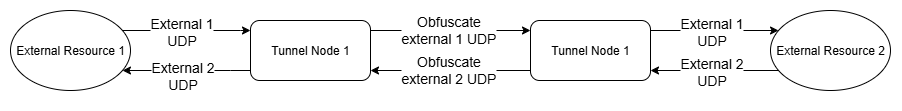

# NetTunnel Udp туннель с обфускации трафика
## Схема взаимодействия узлов туннеля с внешними ресурсами



## Обработка входящих и исходящих пакетов туннеля
Туннелб в текущей реализации ожидает получения udp пакета от внешних источников,
а также использует udp для передачи данных между двумя узлами. Клиент транспорта представлен в виде интерфейса **ITransportClient**
с реализацией протокола Udp (класс **UdpTransportClient**), что позволит в будущем добавлять новые реализации протоколов взаимодействия как в внешними ресурсами, так и между узлами туннеля.

## Обфускация
Обфускация входящих в туннел пакетов пердставленна интерфейсом **IDataObfuscator** и реализацией Xor (класс **XorDataObfuscator**).
Описанный интерфейс позволит в будущем добавлять более схожные механизмы обфускации или маскировки содержимого проходящих через туннел пакетов.

## Запуск
Для запуска и тестирования туннеля необходим **Docker**. Для быстрого запуска компонентов системы был созан docker-compose.yml файл
с конфигурацией запуска системы из двух узлов туннеля, а также генератора upd пакетов с заданным содержимым и udp echo сервер.
Все эти сервисы позволят запустить туннель и пересылать внутри него тестовые пакеты для проверки работоспособности.

Далее представленны варианты запуска всей системы, а также ее частей

### Запуск всей системы локально
Для запуска всей системы локально (без взаимодействия через глобальнуб сеть) необходимо выполнить в терминале следующую команду
```bash
docker compose --profile all up -d
```

### Запуск системы на двух серверах для теста
Перед запуском двух частей системы необходимо изменить конфигурацию по умолчаниию, а именно прописать статический ip адрес сервером, где запускаются два узла туннеля.

Изменения условно клиента туннеля:
```
nettunnel.client-tunnelnode:
    image: ${DOCKER_REGISTRY-}nettunneltunnelnode
    profiles: [client, client-test, all]
    network_mode: "host"
    build:
      context: ..
      dockerfile: src/NetTunnel.TunnelNode/Dockerfile
    environment:
      TunnelNodeSettings__ExternalListenIp: 127.0.0.1
      TunnelNodeSettings__ExternalListenPort: 5000
      TunnelNodeSettings__ExternalTargetHost: 127.0.0.1
      TunnelNodeSettings__ExternalTargetPort: 4000

      TunnelNodeSettings__TunnelListenIp: 127.0.0.1 <-- Заменяем на 0.0.0.0
      TunnelNodeSettings__TunnelListenPort: 5100
      TunnelNodeSettings__TunnelTargetHost: 127.0.0.1 <-- Здесь реальный ip узла конфигцрации Server
      TunnelNodeSettings__TunnelTargetPort: 6100
```
Изменения условно сервера туннеля:
```
nettunnel.server-tunnelnode:
    image: ${DOCKER_REGISTRY-}nettunneltunnelnode
    profiles: [server, server-test, all]
    network_mode: "host"
    build:
      context: ..
      dockerfile: src/NetTunnel.TunnelNode/Dockerfile
    environment:
      TunnelNodeSettings__TunnelListenIp: 127.0.0.1 <-- Заменяем на 0.0.0.0
      TunnelNodeSettings__TunnelListenPort: 6100
      TunnelNodeSettings__TunnelTargetHost: 127.0.0.1 <-- Здесь реальный ip узла конфигцрации Client
      TunnelNodeSettings__TunnelTargetPort: 5100

      TunnelNodeSettings__ExternalListenIp: 127.0.0.1
      TunnelNodeSettings__ExternalListenPort: 6000
      TunnelNodeSettings__ExternalTargetHost: 127.0.0.1
      TunnelNodeSettings__ExternalTargetPort: 7000
```
Для запуска системы с взаимодействием узлов туннеля между двумя серверами необходимо на одном сервере запустить клиентский профиль docker compose,
а на втором серверный профиль. Делается это следующими командами
```
# Запуск узла туннеля и генератора udp пакетов
docker compose --profile client-test up -d
```

```
# Запуск узла туннеля и udp echo сервера
docker compose --profile server-test up -d
```


### Запуск рабочей версии
Запуск рабочей верии происходит аналогично предыдущему запуску только используются профили **client** и **server** соответственно

```
# Запуск узла туннеля
docker compose --profile client up -d
```

```
# Запуск узла туннеля
docker compose --profile server up -d
```